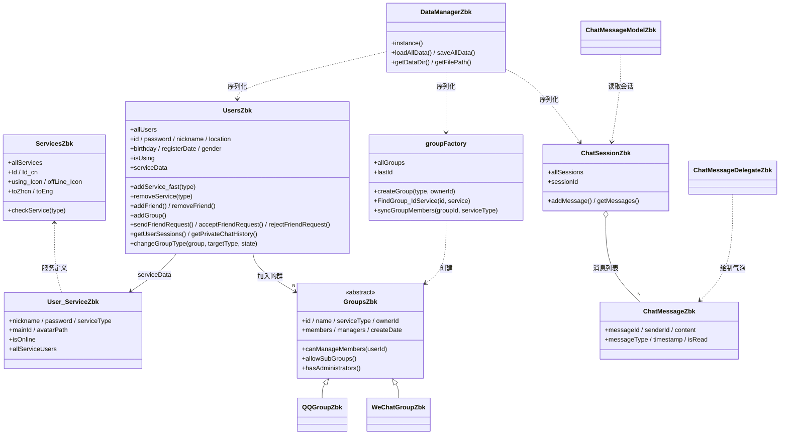
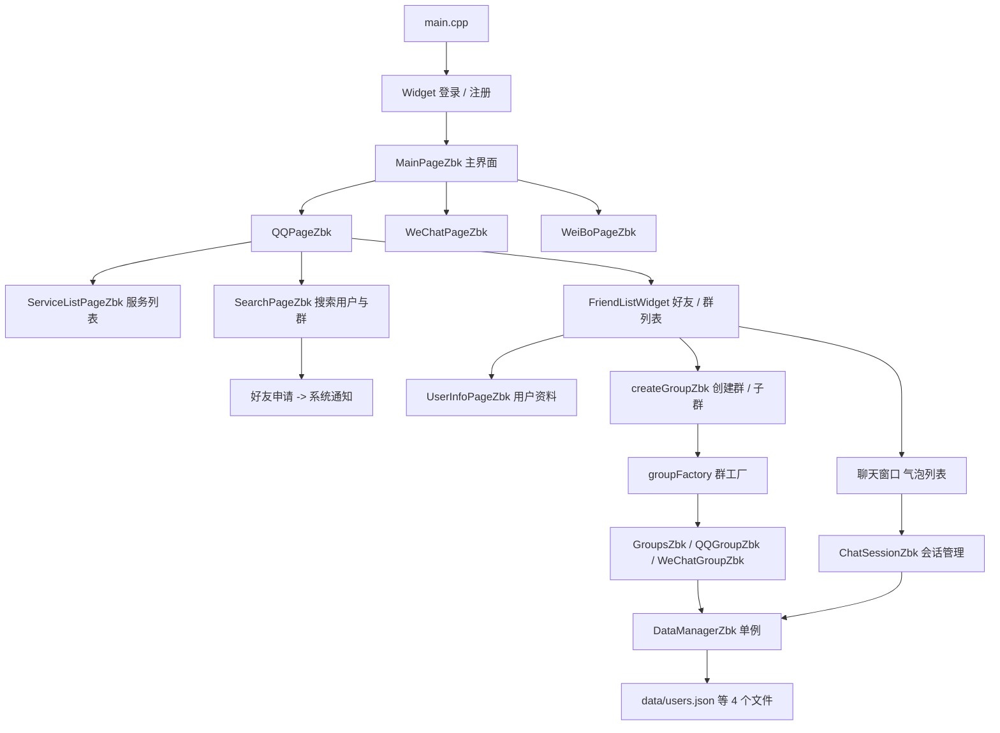

# 模拟即时通信系统（统一社交平台）

**吉林大学 软件学院 · 2025 年面向对象程序课程设计**
课程学期：2025-2026 学年第 1 学期　|　技术栈：Qt 6 + C++17（Qt Widgets）　|　状态：课程作业已完成，不再维护

---

## ⚠️ 免责声明

- 本仓库是**个人课程作业**，是对课程题目「模拟即时通信系统实现 / 统一立体社交软件平台」的**简化模拟实现**，用于练习 C++ 面向对象设计和 Qt 界面开发，不具备任何生产能力。
- 本项目**与腾讯公司没有任何关联，不是腾讯官方产品**。界面中出现的 `Tencent UnityChat`、`UniTencent` 等字样，只是课程题目语境下的命名，用于还原题目场景。
- 项目里的所有「消息」都在本机内存和本地文件中流转，**没有任何真实的网络通信**。
- 界面中使用的图标素材来源于网络，仅供学习交流，**请勿用于商业用途**，如有侵权请联系删除。
- 用户密码以**明文**保存在本地 JSON 文件中，没有任何加密，请勿录入真实密码。

本仓库**不包含**课程设计报告、作业要求文档和作业提交压缩包。代码写于 2025 年 9 月 - 10 月。

---

## 一、项目简介

课程题目要求把 QQ、微信、微博等多个「微X」服务整合成一个统一账号体系下的立体社交平台。本项目用 Qt Widgets 实现了一个可在 Windows 上直接运行的桌面版模拟系统：

- 一个**主账号**可以开通 QQ / 微信 / 微博多个服务，服务之间账号关联，但好友与群相互独立；
- 完整的**好友管理**（搜索、申请、接受 / 拒绝、删除）和**群管理**（创建、加入、退出、成员管理、管理员权限、子群、群类型转换）；
- **私聊与群聊**会话，消息用自绘的气泡列表展示；
- 全部数据以 JSON 持久化，程序启动时加载、退出时保存。

## 二、功能特性

### 账号与服务
- 主账号注册与登录，登录成功后进入主界面
- 在服务页开通 / 注销 QQ、微信、微博；统一账号（`UniTencent`）作为各服务账号的关联主账号
- 每个已开通的服务下维护自己的服务账号资料（昵称、头像、在线状态）以及好友、群列表

### 好友管理
- 搜索页区分「找人」与「找群」两个页签
- 发送好友申请可附带验证消息；收件方在系统通知中**接受 / 拒绝**
- 对同一目标的重复申请会被识别并更新原申请，不会重复堆积
- 支持删除好友、删除系统消息记录

### 群管理
- 创建群、退出群、查看群成员、按关键字搜索群成员
- 权限区分：QQ 群有**群主 + 管理员**制度，可设置 / 取消管理员；微信群**只有群主**是特权账号
- QQ 群允许创建**子群**（临时讨论组），微信群不允许
- 支持在 QQ 群与微信群之间做**群类型转换**，转换时会校验成员在目标服务下的账号状态
- 群通过工厂 `groupFactory` 统一创建与查找，`GroupsZbk` 抽象基类定义接口，`QQGroupZbk` / `WeChatGroupZbk` 各自实现差异化行为

### 聊天
- 私聊会话与群聊会话统一由 `ChatSessionZbk` 管理；消息实体 `ChatMessageZbk` 带有时间戳、已读状态与消息类型
- 聊天列表使用 `QAbstractListModel` + `QStyledItemDelegate` **自绘气泡**（左右分栏、头像、昵称、时间）
- 系统通知会话用于承载好友申请等系统消息

### 数据持久化
- 单例 `DataManagerZbk` 负责全部序列化，JSON 文件保存在**可执行文件同级的 `data/` 目录**：
  - `users.json` —— 用户、服务账号、好友关系
  - `groups.json` —— 群、成员与管理员
  - `chatsessions.json` —— 所有会话与消息
  - `lastids.json` —— 用户号 / 群号自增计数
- 启动时 `loadAllData()`，退出时 `saveAllData()`（`main.cpp` 在事件循环结束后保存）
- 内置会话去重与关联重建，避免重复加载导致数据膨胀

## 三、技术架构

### 3.1 类关系



### 3.2 模块流转



### 3.3 设计要点

- **抽象与多态**：`GroupsZbk` 把 `allowSubGroups()`、`hasAdministrators()` 声明为纯虚函数，QQ 群与微信群各自实现，界面只面向基类编程，这就是「群管理模式动态可变」的实现方式。
- **工厂模式**：`groupFactory::createGroup(type, ownerId)` 根据服务类型创建具体群对象，创建入口唯一。
- **单例模式**：`DataManagerZbk::instance()` 保证全局只有一个数据管理器，负责加载 / 保存。
- **容器类**：`UsersZbk`（全部账号）、`groupFactory::allGroups`（全部群）、`ChatSessionZbk::allSessions`（全部会话）承担题目要求的容器类职责。
- **Model / View + 自定义绘制**：`ChatMessageModelZbk`(QAbstractListModel) 提供消息数据，`ChatMessageDelegateZbk`(QStyledItemDelegate) 负责气泡外观的绘制与尺寸计算。
- **信号与槽**：跨页面刷新统一走信号（例如 `UsersZbk::refreshPage(QString)`、`GroupsZbk::memberAdded`），避免界面之间互相持有指针。

## 四、目录结构

- `unity-chat.pro` —— qmake 工程文件（工程名与仓库名不同，属正常情况）
- `main.cpp` —— 程序入口，启动加载数据、退出保存数据
- 账号与服务：`userszbk.*`、`user_service.*`、`serviceszbk.*`、`registerpage.*`、`widget.*`
- 群相关：`groupszbk.*`、`qqgroupzbk.*`、`wechatgroupzbk.*`、`groupfactory.*`、`creategroupzbk.*`
- 聊天相关：`chatsessionzbk.*`、`chatmessagezbk.*`、`chatmessagemodelzbk.*`、`chatmessagedelegatezbk.*`
- 持久化：`datamanagerzbk.*`
- 主界面与各功能页：`mainpagezbk.*`、`qqpagezbk.*`、`wechatpagezbk.*`、`weibopagezbk.*`、`servicelistpagezbk.*`、`addservicepagezbk.*`、`searchpagezbk.*`、`searchingitemszbk.*`、`userinfopagezbk.*`、`modifyloginuserinfopagezbk.*`
- 自定义控件：`friendlistwidget.*`、`frienditemwidget.*`、`windowbutton.*`
- `pic/` —— 界面图标与头像素材（通过 `main.qrc` 以资源形式打包进程序）

## 五、编译与运行

### 环境要求
- Qt **6.9 及以上**（本仓库在 `Qt 6.10.1 + MinGW 13.1 64bit` 上实测编译通过）
- 支持 C++17 的编译器（MinGW g++ 或 MSVC 均可，工程已配置 `CONFIG += c++17`）

### 方式一：Qt Creator
1. 用 Qt Creator 打开工程文件 `unity-chat.pro`
2. 选择一个 Qt 6 的构建套件（例如 `Desktop Qt 6.10.1 MinGW 64-bit`）
3. 直接构建并运行

### 方式二：命令行
```bash
qmake unity-chat.pro -spec win32-g++
mingw32-make -j8
```
编译产物为 `unity-chat.exe`，Release 模式下位于 `release/` 目录。

程序启动时会在可执行文件同级目录自动创建 `data/` 并生成四个 JSON 文件，无需任何额外准备。如果需要重新开始，删除 `data/` 目录即可。

## 六、使用说明

1. 启动后先点「注册」创建主账号，然后用该账号登录；
2. 在主界面的服务列表中**开通**需要的服务（QQ / 微信 / 微博）；
3. 进入某个服务后，可以在搜索页找人、找群；加好友会以系统消息的形式发送申请；
4. 在好友 / 群列表中发起私聊或群聊，消息会实时显示在气泡列表中；
5. QQ 群可以设置管理员、创建子群；微信群只有群主拥有管理权限；
6. 退出程序时全部数据会自动保存到 `data/` 目录，下次启动自动恢复。

## 七、已知不足与差异

- **未实现题目中的选做项**：QQ 点对点 TCP 通信。整个工程没有任何 socket / 网络相关代码，所有交互都是单机模拟。
- 群号与用户号由 `lastId` 从 100000 开始自增，**没有按题目示例预置 1001 - 1006 等群号**。
- 题目中「查询各微X之间的共同好友」「一个服务登录后其它服务自动登录」等要求只做了简化处理，未完整实现。
- 密码明文存储、无加密、无网络传输，仅用于演示数据持久化流程。
- 界面样式与部分页面逻辑较为集中（例如主界面承担了较多职责），可读性有进一步拆分空间。
- 只针对 Windows 桌面端开发，没有做跨平台适配与高 DPI 精细适配。